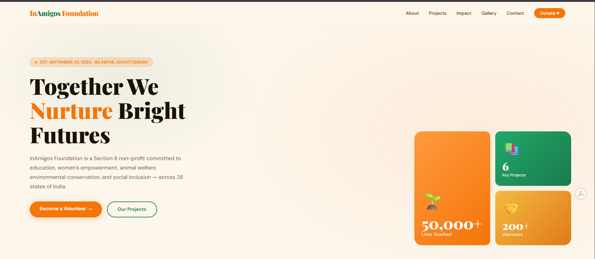
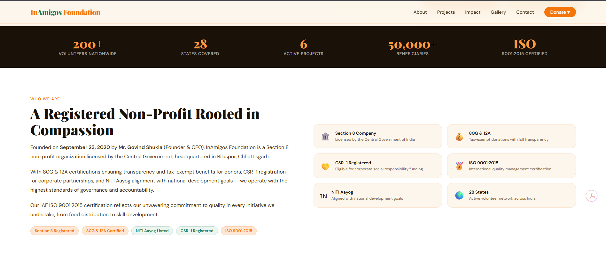
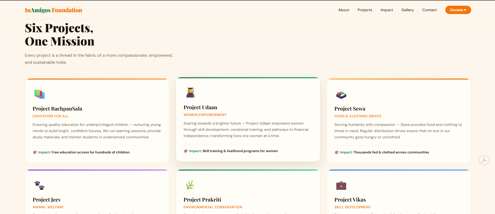
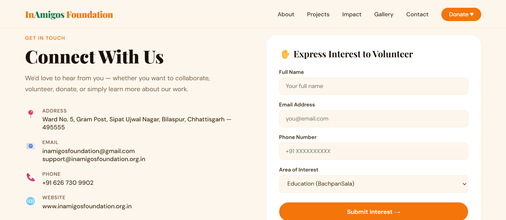

# 🌟 InAmigo — Web Development Projects

A collection of modern, responsive web experiences developed during my work with **InAmigos Foundation**, focusing on social impact, education, accessibility, and modern UI/UX.

The repository contains two independent frontend projects:

- 🌍 **Project 1 — InAmigos Foundation Website**
- 🤖 **Project 2 — LearnSpark AI Learning Platform**

Both projects are built with a strong emphasis on responsive design, clean layouts, interactive UI components, visual storytelling, and user-focused experiences.

---

## 📌 Projects

### 🌍 Project 1 — InAmigos Foundation

A modern landing page and digital presence for InAmigos Foundation, a Section 8 non-profit organization working across areas such as education, women's empowerment, animal welfare, environmental conservation, and social inclusion.

The website is designed to communicate the organization's mission, showcase its initiatives, highlight its impact, and encourage users to volunteer or contribute.

#### ✨ Key Features

- 🏠 Modern hero section with clear calls-to-action
- 📊 Impact statistics and organization highlights
- 🏢 About & certification section
- 🌱 Dedicated project showcase
- 📸 Impact/gallery section
- 💛 Donation call-to-action
- 🙋 Volunteer registration flow
- 📞 Contact and social-media section
- 📱 Responsive design for desktop, tablet, and mobile
- ✨ Smooth animations and hover interactions
- 🎨 Custom visual design using CSS
- 🔗 External integrations for volunteering, donations, and organization links

The implementation uses a warm social-impact visual language with saffron, green, cream, and dark tones, custom typography, responsive grids, cards, gradients, and interactive hover states.

---

## 📸 InAmigos Foundation — Project Screenshots

### 🏠 Homepage / Hero Section

The homepage introduces the foundation's mission, highlights its reach and impact, and provides prominent **Become a Volunteer** and **Our Projects** calls-to-action.



---

### 🏢 About the Foundation

The About section presents the foundation's background, registration/certification information, and organisational footprint, including its work across multiple states.



---

### 🌱 Projects Showcase

The Projects section presents the foundation's six major initiatives, covering education, women empowerment, food and clothing, animal welfare, environmental conservation, and skill development.



---

### 🙋 Volunteer / Contact Section

The Contact section provides organisation contact information together with a structured volunteer-interest form where users can enter their details and select an area of interest.



---

### 🤖 Project 2 — LearnSpark

LearnSpark is a modern concept for an AI-powered learning platform designed around personalised education and career development.

The interface presents a learning ecosystem where AI can help learners identify skill gaps, create personalised learning paths, provide tutoring, track progress, and support project-based learning.

#### ✨ Key Features

- 🎯 Personalised learning roadmap concept
- 🤖 AI Tutor interface
- 📚 Course discovery and course cards
- 📈 Learning progress tracking
- 🔥 Learning streak system
- 🏆 Certificates and achievements
- 🏗️ Project-based learning
- 👥 Community learning concept
- 💬 Testimonials section
- 💳 Pricing plans
- ❓ FAQ section
- 📱 Responsive modern UI
- ✨ Smooth animations and interactive elements

> **Note:** LearnSpark is currently a frontend/UI concept. The AI Tutor, adaptive learning, certificates, payments, and other platform capabilities are represented as product/interface concepts rather than a production backend implementation.

---

## 🛠️ Tech Stack

### Frontend

- HTML5
- CSS3
- JavaScript
- CSS Grid
- CSS Flexbox
- Responsive Web Design
- CSS Animations & Transitions
- Google Fonts

### Design & UI

- Custom CSS design system
- Responsive layouts
- Gradient backgrounds
- Glassmorphism / backdrop blur
- Interactive cards
- Hover animations
- Modern typography
- Mobile-first responsive considerations

The projects primarily use self-contained HTML/CSS implementations rather than a frontend framework, making them lightweight and easy to run.

---

## 📂 Repository Structure

```text
InAmigo/
│
├── Project1/
│   └── index.html
│
├── Project2/
│   └── learn.html
│
├── assets/
│   └── inamigos/
│       ├── homepage.png
│       ├── about.png
│       ├── projects.png
│       └── contact-volunteer.png
│
└── README.md
```

---

## 🚀 Getting Started

Since both projects are static HTML applications, no backend or package installation is required.

### 1. Clone the repository

```bash
git clone https://github.com/manas-verma11/InAmigo.git
```

### 2. Navigate into the project

```bash
cd InAmigo
```

### 3. Run Project 1

Open:

```text
Project1/index.html
```

in your browser.

### 4. Run Project 2

Open:

```text
Project2/learn.html
```

in your browser.

You can also use **VS Code + Live Server** for a better development experience.

---

## 🎨 Design Philosophy

The projects were designed around three principles:

### 1. 🎯 Clear Communication

Important information is presented through structured sections, visual hierarchy, statistics, cards, and clear calls-to-action.

### 2. 📱 Responsive Experience

Layouts use CSS Grid, Flexbox, flexible typography, and responsive breakpoints to adapt the interface to different screen sizes.

### 3. ✨ Modern Visual Design

The interfaces use gradients, rounded cards, typography systems, subtle shadows, hover states, animations, and carefully selected color palettes to create polished experiences.

---

## 🌍 Social Impact Focus

The InAmigos project focuses on using technology to improve the digital presence of a social-impact organization.

The website communicates initiatives around:

- 📚 Education
- 🌸 Women Empowerment
- 🍲 Food & Clothing
- 🐾 Animal Welfare
- 🌱 Environmental Conservation
- 💼 Skill Development

The implementation also provides direct paths for users to volunteer, donate, connect with the organization, and learn about its initiatives.

---

## 🧠 Learning Platform Vision

LearnSpark explores how AI could be incorporated into modern online education.

```text
Learner
   │
   ▼
Set Learning Goal
   │
   ▼
AI Skill Assessment
   │
   ▼
Personalized Learning Roadmap
   │
   ▼
Courses + Practice
   │
   ▼
AI Tutor & Feedback
   │
   ▼
Projects & Assessments
   │
   ▼
Certificates + Career Growth
```

---

## 🔮 Future Improvements

Potential future enhancements include:

- Convert the static pages into React/Next.js applications
- Add reusable UI components
- Add backend APIs
- Add authentication
- Connect a database
- Implement actual AI Tutor functionality
- Add personalised learning recommendations
- Add real course enrollment
- Implement payment integration
- Add admin dashboards
- Add analytics and user tracking
- Improve accessibility with comprehensive WCAG compliance
- Add automated testing
- Deploy production versions

---

## 📄 Project Highlights

### InAmigos Foundation

- Mission-driven landing page
- Impact statistics
- Organization information
- Project showcase
- Donation CTA
- Volunteer CTA
- Contact section
- Responsive card-based layouts
- Volunteer-interest form

### LearnSpark

- AI-powered learning concept
- Learning dashboard mockup
- Course catalog
- Progress tracking
- AI Tutor concept
- Skill roadmaps
- Project-based learning
- Pricing system
- Testimonials
- FAQ

---

## ❤️ Internship Project

Developed by **Manas Verma** as part of the web development internship with **InAmigos Foundation**.

